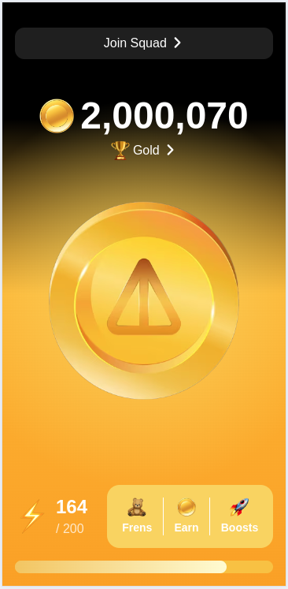

## Overview

This project is a clone of the popular Telegram mini app, Notcoin.
<br/><br/> 

## Getting Started

1. **Clone the Repository**:

   ```bash
   git clone https://github.com/nikandr-surkov/Notcoin-Telegram-Mini-App-Clone.git
   cd Notcoin-Telegram-Mini-App-Clone
   ```

### Setup

1. **Install Dependencies**:

   ```bash
   npm install
   ```

2. **Run the Development Server**:

   ```bash
   npm run dev
   ```

3. **Open Your Browser**:

   Navigate to localhost to see the initial setup.

<br/>
Credit to <a href="https://github.com/nikandr-surkov/Notcoin-Telegram-Mini-App-Clone" target="_blank">Nikandr Surkov</a>
